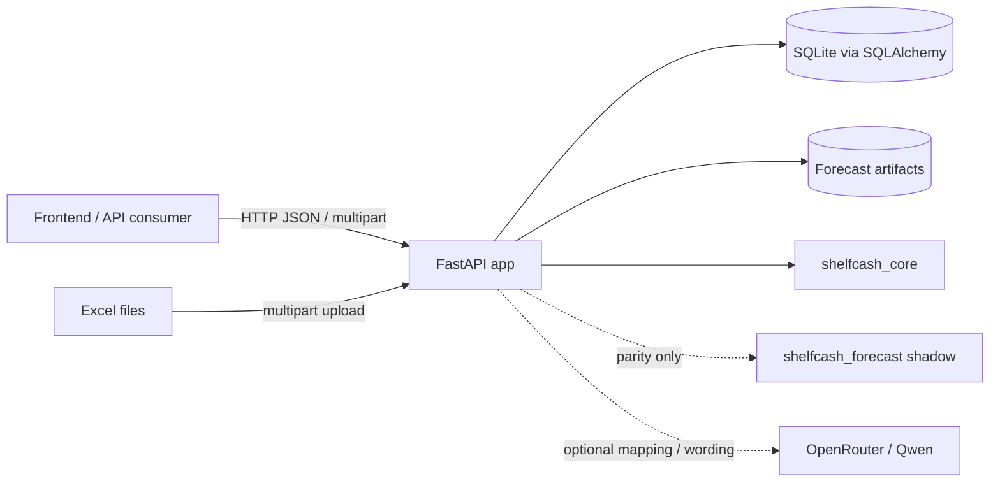
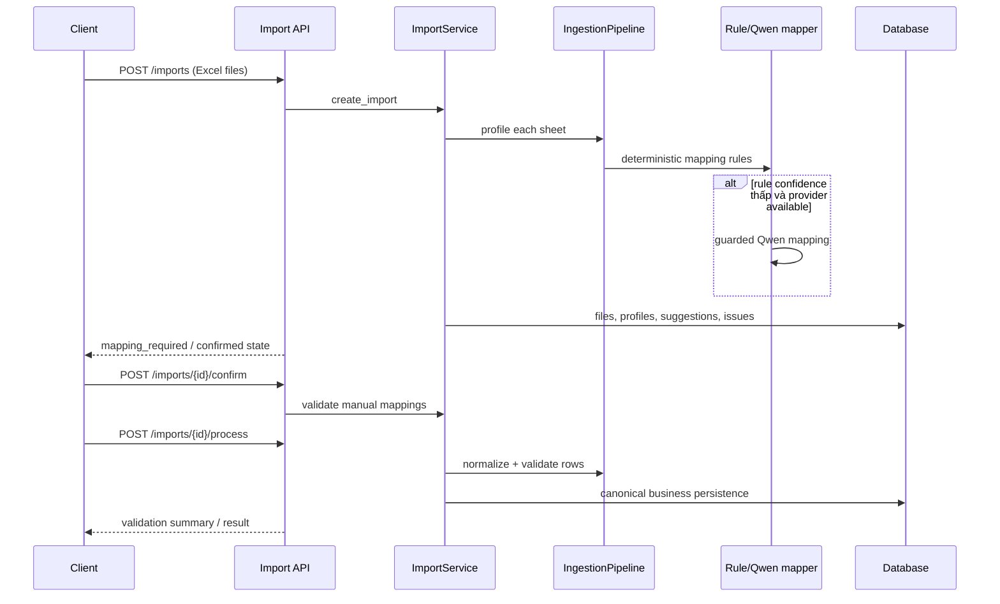
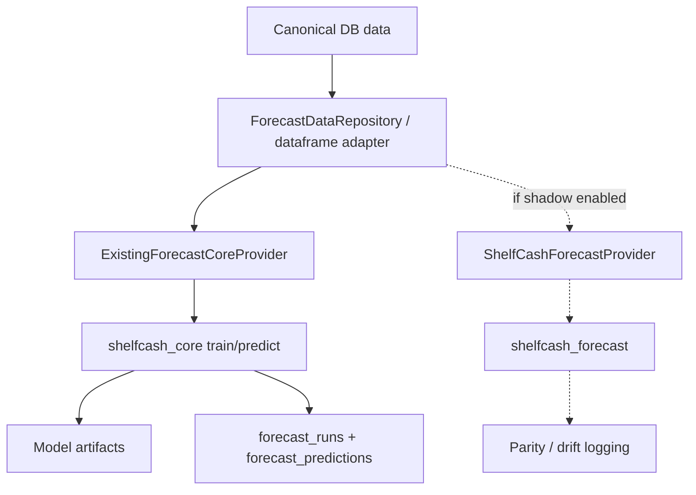

# ShelfCash Backend — Current Architecture

> Tài liệu kiến trúc **as-is**, phản ánh code đang chạy tại ngày 2026-09-07. Đây không phải kiến trúc đích. Khi tài liệu khác với runtime, thứ tự ưu tiên là: route/Pydantic/implementation test → `/openapi.json` → tài liệu này.

## 1. Executive summary

ShelfCash Backend là một modular monolith viết bằng FastAPI. Hệ thống nhận dữ liệu vận hành của cửa hàng (đặc biệt qua Excel), chuẩn hóa và lưu vào SQLite/SQLAlchemy, huấn luyện/chạy forecast, quy đổi forecast sản phẩm sang nhu cầu nguyên liệu qua BOM, mô phỏng tồn kho theo lô/FEFO, tối ưu procurement và đóng gói kết quả thành một immutable-ish `Decision Package`.

Qwen qua OpenRouter không phải nguồn quyết định kinh doanh. Quyết định, số liệu, strategy, risk và what-if đều do backend tính. LLM hiện được dùng ở hai loại công việc:

1. suy đoán mapping cho sheet khi rule engine thiếu tự tin;
2. diễn đạt lại facts đã được backend cho phép thành nội dung người dùng đọc.

Codebase hiện có ba khối lớn:

| Khối | Quy mô tương đối | Vai trò hiện tại |
|---|---:|---|
| `app/` | 133 file Python, khoảng 15k LOC | HTTP API, orchestration, persistence, DTO, LLM gateway và presentation của Decision Assistant |
| `shelfcash_core/` | 84 file Python, khoảng 10k LOC | Forecast core production, BOM, scenario, inventory simulation và optimization thuần |
| `shelfcash_forecast/` | 131 file Python, khoảng 24.5k LOC | Forecast core mới chạy shadow/parity và một decision-intelligence package riêng |

Hai package core đang bị overlap đáng kể: có 81 relative module path chung; 21 file giống byte-for-byte, 60 file cùng tên nhưng đã diverge; `shelfcash_core` có 3 file riêng và `shelfcash_forecast` có 50 file riêng. Đây là điểm phình lớn nhất và có rủi ro sửa một bên nhưng quên bên còn lại.

## 2. System context



Không có message broker, worker queue hay microservice boundary trong repo hiện tại. Những job như import, forecast và decision được thực thi trong process của API; trạng thái run được persist vào database.

## 3. Runtime composition

Entrypoint là `app.main:app`.

Trong FastAPI lifespan, ứng dụng:

1. tạo các thư mục upload, result và forecast artifact;
2. tạo SQLAlchemy engine và session factory;
3. tạo/load một `OpenRouterLLMGateway`;
4. khởi tạo singleton service và gắn vào `app.state`;
5. khi shutdown, đóng LLM provider và dispose database engine.

Các singleton service chính:

| Service | Trách nhiệm |
|---|---|
| `ImportService` | vòng đời import, profile sheet, mapping, validation và business persistence |
| `CatalogApiService` | ingredient, alias và một phần product catalog |
| `MenuService` | product/menu, combo graph và component replacement |
| `RecipeApiService` | active recipe và recipe version |
| `OperationalService` | read model phân trang cho imports/history/inventory/settings/calendar |
| `ForecastService` | train/predict, artifact registry, forecast run persistence và shadow comparison |
| `DecisionPlanningService` | ingredient demand, procurement plan, legacy plan adapter, Decision Run, brief, explanation và what-if |
| `CompletionService` | các write API vận hành và adapter tương thích cho forecast/plan/PO |

Dependency injection ở route chỉ lấy các object này từ `request.app.state`. Transaction boundary chủ yếu là `with session_factory() as session` nằm trong từng service method; `UnitOfWork` tồn tại nhưng không phải boundary thống nhất cho toàn bộ application layer.

### Cross-cutting behavior

- `RequestIdMiddleware` nhận hoặc sinh `X-Request-ID`, đưa vào logging context và response header.
- CORS lấy từ `Settings.cors_origins`.
- `x-shelfcash-key` được kiểm tra bằng constant-time comparison nếu `SHELFCASH_API_KEY` được cấu hình. Nếu setting rỗng, các route có dependency này vẫn mở.
- Domain exception, validation exception và unknown exception được chuẩn hóa về `{code, message, details, request_id}`.
- Các write flow quan trọng có idempotency record và audit log, nhưng coverage không đồng đều giữa mọi write endpoint.

## 4. Module map

### `app/api`

Thin HTTP adapters, khai báo route, path/query/header/body và gọi service. Có 70 operations thuộc các nhóm health, LLM, import, catalog/menu/recipe, operational, constraints, completion, forecast và planning.

Điểm cần lưu ý: `app/api/completion.py` vừa định nghĩa nhiều Pydantic request models ngay trong route file, vừa gom 27 operations rất khác nhau dưới tag `contract`. Đây là một composition root thứ hai ở cấp route và làm contract khó tìm.

### `app/schemas`

Pydantic contracts cho import, catalog, menu, recipe, forecast, planning và decision. Một số endpoint đã có typed response đầy đủ, nhưng nhiều endpoint trả `dict` không có `response_model`; vì vậy OpenAPI chỉ biết `{}` dù runtime có shape cụ thể.

### `app/services`

Application orchestration và phần lớn business workflow. Service vừa gọi repository, vừa có chỗ query ORM model trực tiếp. Một số service còn chứa serialization logic và response-shape logic, nên boundary domain/application/transport chưa tách rõ.

### `app/repositories` và `app/models`

- `models`: SQLAlchemy ORM model.
- `repositories`: query helper theo aggregate/use case.
- Thực tế service có thể dùng cả repository lẫn `session.get/select` trực tiếp.

### `app/core`

Các rule/utility backend-specific: Excel reader, sheet profiler, canonical schemas, rule mapper, normalizer, validator, business constraint registry, unit/name normalization, request ID và ingestion pipeline.

### `app/forecasting`

Anti-corruption/provider layer giữa `ForecastService` và hai forecast package:

- `ExistingForecastCoreProvider` gọi `shelfcash_core` — production provider duy nhất được cho phép;
- `ShelfCashForecastProvider` gọi `shelfcash_forecast` — chỉ được khởi tạo làm shadow provider;
- `comparator.py` và `qualification.py` đo structural parity và numeric drift.

### `app/decision_intelligence`

Read/presentation layer của Decision Assistant trong API app:

- build `DecisionBriefFacts` từ persisted Decision Package;
- tạo semantic evidence và citation;
- trình bày warning/risk/strategy;
- deterministic summary và ingredient synthesis;
- guarded LLM wording cho summary, explanation, what-if, ingredient synthesis và strategy expression.

Module này không được quyền thay đổi optimizer output.

### `shelfcash_core`

Core production hiện được app gọi trực tiếp cho:

- forecast training/inference;
- BOM propagation;
- scenario generation;
- lot-level inventory simulation/FEFO;
- deterministic/stochastic procurement optimization;
- exact resimulation, constraint checks và critic.

Các hàm domain phần lớn nhận/ trả Pydantic contract hoặc dataframe, không phụ thuộc FastAPI/SQLAlchemy.

### `shelfcash_forecast`

Một nhánh core mới có phần forecast/BOM/inventory/optimization tương tự `shelfcash_core`, cộng thêm `decision_intelligence/agents`, approval, evaluation, regret và what-if riêng. Trong runtime app hiện tại:

- forecast package này chỉ được gọi qua shadow provider khi bật cấu hình;
- `app/decision_intelligence/adapter.py` import một phần evidence/retrieval contract từ package này;
- phần lớn agent/approval/evaluation code không nằm trên HTTP request path chính.

## 5. Main business flows

### 5.1 Import flow



Chi tiết:

- Excel được lưu dưới `runtime/uploads` theo cấu hình.
- Mỗi sheet có profile, sample rows, mapping suggestion và issues.
- Rule mapper chạy trước; Qwen chỉ được gọi khi confidence dưới threshold.
- `confirm` bắt buộc mapping hoàn chỉnh trước khi xử lý.
- `process` hỗ trợ `atomic`, `partial_success`, `preview_only`.
- Business persistence cập nhật catalog, history, inventory, recipe, supplier terms, calendar, constraints và menu tùy sheet type.

### 5.2 Catalog, menu, recipe và operational data

Catalog/menu/recipe API thao tác trực tiếp trên canonical business tables. Product có thể là `single` hoặc combo; combo dùng `product_bundle_lines`. Recipe dùng version theo `effective_from/effective_to` và content hash. Ingredient alias giải quyết tên nguồn sang canonical ingredient.

Operational GET API tạo read model phân trang từ ORM state. Completion write API ghi inventory count/adjustment, batch sales/purchase, settings, calendar, constraints, supplier terms và purchase orders; phần lớn có optimistic version hoặc `Idempotency-Key` tùy operation.

### 5.3 Forecast flow



`FORECAST_CORE_PROVIDER` phải là `existing`; setting khác bị từ chối khi tạo `ForecastService`. Core mới chỉ chạy nếu cả `forecast_shadow_enabled=true` và `forecast_shadow_provider=shelfcash_forecast`.

Forecast output gồm p25/p50/p75, interval, baseline p50, calibration source và warnings. Artifacts được version theo store/model version trong filesystem; metadata và prediction rows được lưu trong database.

### 5.4 Ingredient demand và procurement plan

1. Một completed `forecast_run` được load cùng product predictions.
2. `CoreBomAdapter` resolve recipe/BOM và propagate product quantiles thành ingredient quantiles.
3. Ingredient demand được persist vào `ingredient_demand_runs/predictions`.
4. `CoreProcurementAdapter` load inventory lots, open inbound, supplier terms, budget và business constraints.
5. Scenario set được tạo:
   - deterministic mode: ba design scenarios p25/p50/p75;
   - stochastic mode: thử residual/bootstrap scenarios có probability; nếu không đủ dữ liệu thì fallback về deterministic design scenarios.
6. `shelfcash_core.optimize_procurement` tạo ba candidate `LEAN/BALANCED/PROTECTED`.
7. Mỗi candidate được exact lot-level FEFO resimulation và critic kiểm tra.
8. Recommendation là candidate hợp lệ có `purchase_cost` thấp nhất; hòa thì theo tên strategy.
9. Run, plans, lines, metrics, daily projections và warnings được persist.

### 5.5 Decision Run

`POST /stores/{store_id}/decision-runs` là flow mới hơn nhưng default setting hiện vẫn là `decision_engine_mode=legacy`. Nếu request không truyền `engine_mode` và setting vẫn legacy, endpoint trả 409 `DECISION_ENGINE_LEGACY`. Client phải truyền `deterministic`/`stochastic` hoặc đổi config.

Flow:

1. validate forecast/store/cutoff/horizon;
2. rebuild ingredient demand bằng core hiện tại;
3. chạy procurement adapter và optimizer;
4. build self-contained Decision Package;
5. persist `decision_runs.package_json` trước;
6. sau commit mới tạo/persist assistant overall summary và ingredient synthesis; lỗi narrative không invalidate Decision Run.

Decision Package top-level hiện gồm:

```text
decision_run_id, store_id, as_of_date, horizon_days, status, engine_mode,
recommended_strategy, business_metrics, recommended_plan, ingredient_demand,
inventory_risk, strategies, strategy_selection, stress_tests, critic,
reason_codes, warnings, technical_metrics, assistant (sau enrichment)
```

Package được lưu dạng JSON text. Các field assistant được bổ sung sau core commit, vì vậy package là snapshot business nhưng không hoàn toàn immutable về mặt vật lý.

### 5.6 Decision brief, explanation và what-if

- `/brief` build read model typed từ package đã persist; old run thiếu assistant fields được bổ sung trong response bằng deterministic renderer, không backfill DB.
- `/explanation` đọc semantic facts/citations từ đúng Decision Run snapshot rồi gọi guarded narrative provider; nếu provider lỗi/unavailable thì deterministic/template fallback.
- `/what-if` chạy lại M1–M5 trong memory với demand multiplier, supplier delay, budget hoặc forced strategy. Nó không persist ORM entity mới. Response chứa baseline, hypothetical, comparison và grounded explanation.

## 6. Qwen/OpenRouter responsibility matrix

| Task | Trigger hiện tại | Backend đã quyết định sẵn gì? | Guard/fallback | Nhận định refactor |
|---|---|---|---|---|
| Excel mapping | Rule confidence dưới threshold hoặc gọi `/llm/map-sheet` | canonical schema, rule suggestion | strict JSON schema, mapping validation, rule fallback | Giữ hybrid: deterministic rule trước, LLM chỉ xử lý cột mơ hồ |
| Plan overall summary | Sau khi Decision Package commit, nếu provider available | recommendation, metrics, risks, evidence | schema + grounding validation; deterministic fallback | Candidate mạnh để thay hoàn toàn bằng deterministic presentation engine nếu format/câu chữ là hữu hạn |
| Ingredient synthesis | Mặc định deterministic; Qwen chỉ khi `ingredient_synthesis_mode=llm_polish` | importance, facts, evidence IDs | per-ingredient validation và deterministic fallback | Default hiện đã đúng hướng; cân nhắc xóa polish path nếu không đo được giá trị |
| Strategy expression | Mặc định deterministic; Qwen chỉ khi `strategy_expression_mode=llm_polish` | status, reasons, numbers, entities | cấm số/entity/reason ngoài whitelist; fallback | Candidate mạnh để deterministic-only vì LLM bị giới hạn gần như renderer |
| Decision explanation | Mỗi POST explanation khi provider available | intent facts, recommendation, risks, evidence | schema, citation, number/entity/causal grounding; deterministic fallback | Giữ LLM cho câu hỏi mở; route các intent đóng sang deterministic engine |
| What-if explanation | Sau in-memory what-if | toàn bộ mutation/comparison/order/risk facts | same guarded narrative family; deterministic fallback | Computation phải deterministic; prose có thể hybrid theo loại câu hỏi |

OpenRouter gateway dùng task profile riêng cho mapping, narrative và summary; temperature mặc định 0, structured output và strict schema mặc định bật. Gateway còn sở hữu một event-loop thread riêng để tái sử dụng async HTTP client từ các sync service path.

Điểm cốt lõi: Qwen không chọn strategy, không tính forecast, không tính order quantity và không thay đổi Decision Package. Nếu một output chỉ là phép ánh xạ hữu hạn từ facts sang câu mẫu, deterministic renderer sẽ giảm code guard, latency, token cost và failure surface.

## 7. Persistence architecture

Database default là SQLite tại `runtime/shelfcash.db`; schema được quản lý bởi 25 Alembic migrations.

| Aggregate | Tables |
|---|---|
| Store/config | `stores`, `store_settings`, `budget_periods`, `calendar_features` |
| Import staging | `import_jobs`, `import_files`, `import_sheet_profiles`, `import_mappings`, `import_issues`; thêm legacy `imports` |
| Catalog/BOM | `products`, `product_bundle_lines`, `ingredients`, `ingredient_aliases`, `recipe_versions`, `recipe_lines`, `suppliers`, `supplier_ingredient_terms` |
| Operational history | `sales_daily`, `usage_daily`, `purchase_receipts`, `inventory_lots`, `inventory_movements` |
| Constraints | `inventory_constraints`, `legacy_supplier_inventory_values` |
| Forecast | `forecast_model_versions`, `forecast_runs`, `forecast_predictions`, `forecast_residuals` |
| Planning | `ingredient_demand_runs`, `ingredient_demand_predictions`, `procurement_plan_runs`, `procurement_plans`, `procurement_plan_lines` |
| Legacy planning/PO | `plan_runs`, `recommendations`, `purchase_orders`, `purchase_order_lines` |
| Decision/audit | `decision_runs`, `idempotency_records`, `audit_logs` |

Nhiều snapshot/diagnostic được lưu trong `*_json` text columns. Cách này giúp persist package nhanh nhưng làm schema evolution, query/index và partial migration khó hơn.

## 8. Configuration and external state

Các nhóm setting chính:

- app/logging/CORS/API key;
- upload size, sheet/row/sample limits và runtime directories;
- OpenRouter model/profile per task;
- deterministic vs `llm_polish` cho strategy/ingredient presentation;
- forecast artifact/version/history/horizon;
- production/shadow forecast provider;
- decision engine mode, scenario count, seed và method;
- SQLAlchemy database URL.

External state chỉ gồm database, uploaded Excel files, result files, forecast artifacts và OpenRouter HTTP API.

## 9. Contract and test posture

- Runtime OpenAPI hiện có 70 operations trên 58 paths.
- Pydantic request models phần lớn dùng `extra="forbid"` ở write/decision flow.
- Một số response quan trọng được typed (`ImportResponse`, forecast, recipe, inventory constraints, Decision Brief/Explanation/What-if).
- Nhiều operational/completion/planning response vẫn là untyped dict; đây là contract debt rõ ràng.
- Test suite bao phủ import, catalog, forecast, BOM, FEFO, optimization, decision, LLM fallback, grounding và API route manifest.

## 10. Refactor hotspots observed from current code

Phần này chỉ ghi nhận rủi ro để lên kế hoạch; không đề xuất refactor “big bang”.

### P0 — Chọn một canonical computation package

`shelfcash_core` và `shelfcash_forecast` cùng chứa forecast/BOM/inventory/optimization. Nên hoàn tất parity gate, chọn package canonical, sau đó xóa adapter/shadow/duplicate theo từng vertical slice. Tránh tiếp tục feature development song song trên cả hai.

### P0 — Đóng contract cho các response đang là `dict`

`Decision Package`, ingredient-demand, procurement-plans, menu/operational và nhiều completion/PO responses chưa có response model. Trước khi di chuyển code, tạo Pydantic DTO và contract test để refactor không vô tình đổi payload.

### P1 — Tách Decision Planning orchestration

`DecisionPlanningService` hiện sở hữu ít nhất sáu use case và cả serialization/persistence/narrative. Boundary hợp lý hơn:

```text
GenerateIngredientDemand
GenerateProcurementPlans
GenerateDecisionRun
ReadDecisionPackage / BuildDecisionBrief
ExplainDecision
EvaluateWhatIf
```

Mỗi use case có input/output typed và transaction policy riêng.

### P1 — Deterministic presentation engine

Tạo một renderer registry dựa trên semantic fact/reason code/audience/language. Chuyển plan summary, ingredient synthesis và strategy presentation về renderer này. Chỉ giữ LLM cho ambiguity thật sự: Excel mapping khó và natural-language question mở.

### P1 — Tách compatibility/legacy API

`completion.py`, legacy forecast/plan adapters và modern planning route đang nằm cùng `/api/v1`. Nên đánh dấu lifecycle rõ: canonical, compatibility, deprecated; sau đó có deprecation telemetry trước khi xóa.

### P2 — Chuẩn hóa repository/UoW boundary

Chọn một pattern duy nhất: service dùng repositories qua UoW, hoặc application query service rõ ràng. Hiện tại mixed direct ORM/repository khiến transaction và test seams không đồng nhất.

### P2 — Version hóa persisted JSON

Thêm `package_schema_version`/typed migration strategy cho Decision Package và các metrics blob. Không nên dựa vào các `dict.get` fallback vô hạn cho old run.

### P2 — Giảm transport/runtime complexity của LLM

Sau khi thu hẹp task LLM, có thể bỏ bớt sync-to-async bridge, owner-loop thread và validator dành cho những output đã deterministic hóa.

## 11. Suggested safe refactor sequence

1. Freeze và test các contract hiện tại, ưu tiên response untyped.
2. Thêm telemetry cho route/model/provider thực sự được dùng.
3. Tách deterministic presentation engine nhưng giữ payload y hệt.
4. Route closed intents sang deterministic engine; giữ open-ended explanation qua LLM.
5. Hoàn tất forecast parity, chọn canonical package và xóa duplicate theo module.
6. Tách `DecisionPlanningService` thành use cases.
7. Tách legacy route/service và lên deprecation plan.
8. Chuẩn hóa persistence boundary và version hóa JSON package.

## 12. Source map

Các file nên đọc đầu tiên khi thay đổi kiến trúc:

- `app/main.py` — composition root, middleware, exception contract, router registration.
- `app/config.py` — feature flags/provider/runtime defaults.
- `app/api/*.py` — HTTP surface.
- `app/services/import_service.py` và `app/core/ingestion_pipeline.py` — import pipeline.
- `app/services/forecast_service.py` và `app/forecasting/providers.py` — production/shadow forecast.
- `app/services/decision_planning_service.py` — planning/decision orchestration.
- `app/services/decision/adapters/*.py` — persistence-to-core boundaries.
- `shelfcash_core/optimization/optimizer.py` — candidate selection and deterministic/stochastic switch.
- `app/decision_intelligence/*.py` — brief/evidence/presentation/LLM guards.
- `app/llm/openrouter_qwen.py` — provider transport, task profiles and structured-output validation.
- `app/models/*.py`, `app/repositories/*.py`, `alembic/versions/*.py` — persistence.
- `docs/CURRENT_API_CONTRACT.md` — endpoint/input/output inventory đi kèm tài liệu này.
